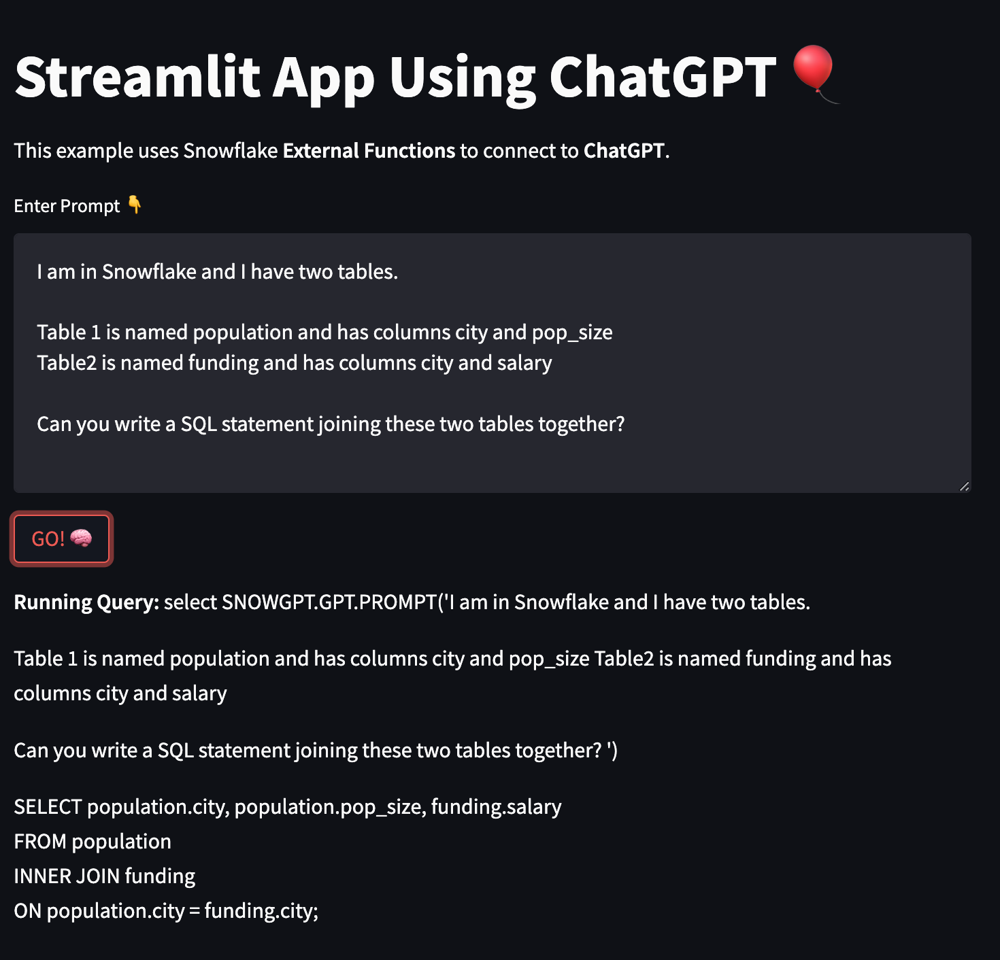
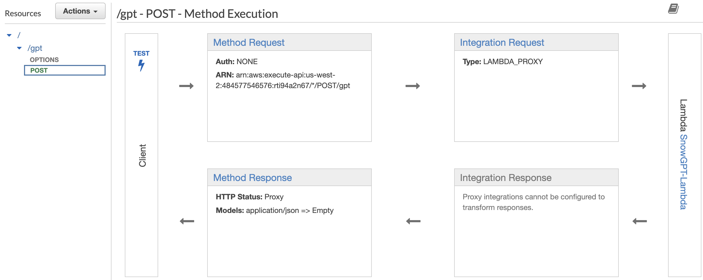

# snowgpt
ChatGPT via Snowflake External Function & Streamlit. 

This demo uses [Snowflake External Functions](https://docs.snowflake.com/en/sql-reference/sql/create-external-function) to make a HTTP POST call to an API function. 

The API function thereafter calls a [Lambda Function](lambda.js) which sends the prompt to ChatGPT. 

ChatGPT processes the prompt and the API returns the response to Snowflake/Streamlit. 
  

Example below:

  

## API Gateway Design
The API is deisgned as outlined below. Taking the input and thereafter sending it to Lambda which processes the request via ChatGPT. Once processed the response is returned, completing the round trip.

 

## Lambda Layer
The Lambda Function is built using Node.js (V18) and requires a [Lambda Layer](ChatGPT-Layer.zip) with the ChatGPT Node library. The Lambda Layer is simply accomplished via <b>npm install chatgpt</b> found [here](https://github.com/openai/openai-node) and provided by openAI.

 

## Snowflake External Function
Once the above infrastructure is set up and working. You are now ready to create the [Snowflake External Functions](https://docs.snowflake.com/en/sql-reference/sql/create-external-function)(please do refer to the Snowflake Docs to do this corretly). 

[set-up.sql](set-up.sql) is an example of how I was able to set this up in my Snowflake account. There are also some permissions required to set up on [AWS-IAM policies](https://docs.snowflake.com/en/sql-reference/external-functions-creating-aws-planning).

 

## Conclusion
Once all the above is set up you are now able to interact with ChatGPT via Snowflake through external functions. 

One final note I will make is that this function <b>currently</b> only handles one row input. Meaning if you have a table of many rows that you want to sent to ChatGPT there are code modifications necessary. 